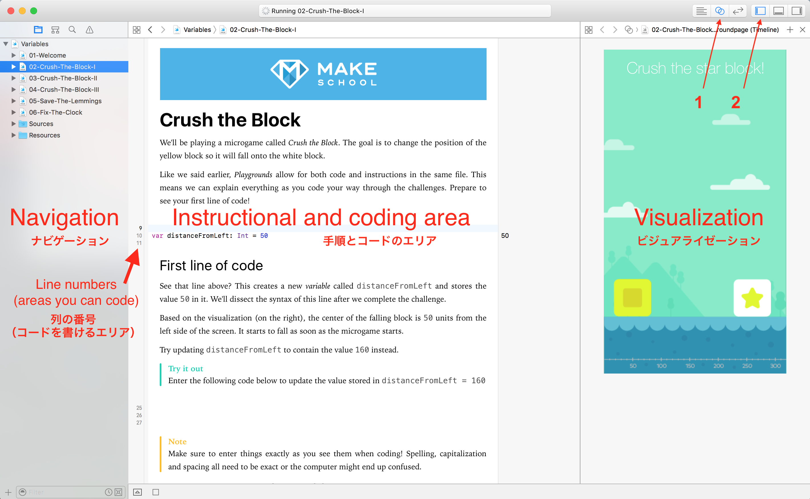

_Swift Playgrounds_ について知りましょう。

## Playgroundsについて

_Playgrounds_　とはインタラクティブなコーディング環境です。書いたコードがすぐにページの右側に反映されます。これで簡単にプログラミングが学べるのです！

# Playgroundsのインターフェース

今は3つのメインエリアだけ覚えておけば良いでしょう: ナビゲーションとインストラクション・プログラミングエリア、ビジュアライゼーションです。

## ナビゲーション

このエリアは他のページに進むのに使います。インストラクション・プログラミングエリアにも"Next"や"Previous"ボタンがあるのでこちらも使えます。もしこのナビゲーションエリアが見えなかったら、上のスクリーンショットの`2`のボタンを押すと表示されるはずです。

## インストラクション・コーディングエリア

ここでコードを書いていきます。左側に小さな番号がついている列にはコードを書き込むことができます。

## ビジュアライゼーション

多くのPlaygroundは、インタラクティブに動くビジュアルと結びついています！スクリーンショットの`1`のボタンを押してビジュアルエリアを開きましょう。

# Xcodeの設定

XcodeとPlaygroundを使いやすくするために、２つの設定を変更します。

> [action]
> ## 列番号を表示させる
1. メニューバーから、`Xcode > Preferences`を選択し、開きます。 
1. `Text Editing`をクリックします。_Line Numbers_ の横のボックスにチェックマークを入れます。
>
> ## キーボードショートカットを設定する
1. `Text Editing`の横の`Key Bindings`をクリックします。
1. 検索バーで`execute`と入力します。
1. `Execute Playgrounds`の隣の白いスペースをダブルクリックします。
1. `option`と`r`を同時に押します。
1. 下の白いスペースをクリックします。
1. 下のgifアニメを見ながら、ショートカットの追加が正しく出来たか確認しましょう。
>

# Playgroundsでコードを実行する

Playgroundsは、コードを書き終えると自動的に実行されるようになっています。

## マニュアルでコードを実行する

もしコードが実行されなかったら、手動でも実行することができます。下の左側にある小さなプレイボタンを押すと実行されます。 

## 重いコンピュータを使っていたら

動きが遅いコンピュータを使っているときは、自動的に実行する設定を使わない方が良い時があります。その時は、プレイボタンを長押しして、`Manually Run`をクリックして自動実行の設定をオフにしましょう。 

`option`+`r`を押すか、プレイボタンを押すことでコードを実行できます。

# 上手くコードが動かない！

Playgroundsはいくつかのサインを持っています。それぞれのサインによって、どうしてコードが動かないのかが分かります。これからいくつか例を紹介しますが、コードの内容自体はそれほど気にしなくても大丈夫です。

Xcodeが何を伝えようとしているのかを理解するのは重要です。それが理解できれば、問題が起きても自分で解決しやすくなります。もちろん、周りの人に聞いても大丈夫ですよ！

## エラー

エラーは`!`が中に入っている赤い八角形のマークです。そのマークをクリックすると詳細のメッセージが表示されます。このエラーは解決しないとコードが実行できません！

## 解決法付きのエラー

解決法がついているエラーは、`!`の代わりに、白い丸印が中に入っているマークです。このマークをダブルクリックすると、`Fix-it`という解決方法が表示されます。この解決方法をダブルクリックすると、Xcodeが自動的にエラーを直してくれます。このエラーも直さないとコードが実行できません！

## 警告

警告は、解決しなくてもコードを実行できます。黄色の三角のマークのものが警告です。たまに、`Fix-it`という解決方法が表示されることもあります。

警告やエラーは、たまに複数のメッセージを含んでいることがあります。例の動画の中で、グレーの`2`マークをクリックして、そのメッセージを見ていますね。

# ビジュアライゼーションが動かない

Playgroundsはたまにうまく動かない時があります。ページを切り替えるときに良く起こります。

## ビジュアライゼーションを開いていますか？

まずはビジュアル画面を開いているかを確認しましょう！

## 開いているのに動かない...

ビジュアルエリアが"Timeline"にセットされているか確認しましょう。下のgif動画のように"Manual"ではなく"Timeline"を開いているかをチェックします。

## それでも動かない...

コードにエラーが発生していませんか？エラーがあるとビジュアライゼーションは動きません！

## それでも動かない!!!

_重いコンピューターを使っていたら_ のセクションを見て、手動でコードを実行する設定に書き換えましょう。全てのPlaygrounファイルで設定を変える必要があります。
